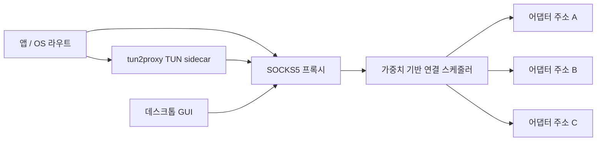

# net-combiner

[English](README.md)

`net-combiner`는 여러 네트워크 어댑터를 하나의 로컬 엔드포인트처럼 쓰기 위한 데스크톱 프로그램입니다. 로컬 어댑터 주소를 찾고, 사용자가 선택한 주소들을 SOCKS5 프록시 뒤에 묶습니다. VPN 모드를 켜면 `tun2proxy` sidecar가 로컬 트래픽을 잡아 같은 프록시로 넘기고, 프록시는 선택된 어댑터들 중 하나로 연결을 내보냅니다.

목표는 명확합니다. Wi-Fi와 유선, USB 테더링과 Wi-Fi, 또는 여러 overlay/private 네트워크를 한 번에 쓰고 싶을 때, 각 앱마다 프록시 설정을 반복하지 않고 한 곳에서 제어할 수 있게 만드는 것입니다.

## 현재 기능

- Rust와 `egui` 기반 네이티브 데스크톱 GUI.
- Windows, macOS Intel, macOS Apple Silicon, Linux 릴리즈 타깃.
- 기본 화면에는 public/private 어댑터만 표시하고, 옵션에서 link-local/loopback까지 표시 가능.
- SOCKS5 no-auth 프록시.
- TCP `CONNECT` 및 UDP `ASSOCIATE` 지원.
- 연결 단위 weighted round-robin egress 선택.
- `tun2proxy`를 통한 로컬 VPN 모드.
- 대상 주소, 사용 어댑터, 상태, 바이트 카운터를 보는 연결 모니터.
- UTF-8 로그 파일과 로그 회전.
- 기본 영어 UI, 한국어 UI 포함.
- Windows 및 macOS 시스템 트레이.
- GitHub Releases 기반 portable 빌드 자동 업데이트.

## 동작 구조



프록시는 각 outbound 연결을 선택된 로컬 어댑터 주소 중 하나에 bind합니다. 선택은 패킷 단위가 아니라 연결 단위입니다. 따라서 하나의 TCP 연결은 하나의 어댑터를 계속 사용하고, 여러 연결이 동시에 있을 때 선택된 링크들로 분산됩니다.

VPN 모드는 같은 프록시를 띄운 뒤 `tun2proxy`를 실행합니다. TUN 인터페이스와 라우팅 처리는 sidecar가 담당하고, 캡처된 트래픽은 로컬 SOCKS5 프록시로 들어옵니다.

## 설치

최신 릴리즈는 여기에서 받을 수 있습니다.

<https://github.com/ivLis-Studio/net-combiner/releases>

GitHub Actions가 다음 파일들을 생성합니다.

- `net-combiner-windows-x86_64-setup.exe`
- `net-combiner-x86_64-apple-darwin.pkg`
- `net-combiner-aarch64-apple-darwin.pkg`
- `net-combiner-x86_64-unknown-linux-gnu.deb`
- `net-combiner-portable-x86_64-pc-windows-msvc.zip`
- `net-combiner-portable-x86_64-apple-darwin.tar.gz`
- `net-combiner-portable-aarch64-apple-darwin.tar.gz`
- `net-combiner-portable-x86_64-unknown-linux-gnu.tar.gz`

Windows 설치 프로그램은 `net-combiner.exe`, `tun2proxy-bin.exe`, `wintun.dll`을 같은 설치 폴더에 둡니다. macOS `.pkg`와 Linux `.deb`도 앱과 `tun2proxy` sidecar를 함께 설치합니다. portable archive 역시 같은 side-by-side 구조이며, 내장 업데이트 기능도 이 archive를 사용합니다.

macOS 패키지는 현재 직접 배포와 테스트를 위한 unsigned 빌드입니다. Gatekeeper 경고가 뜰 수 있습니다. Apple Developer 서명과 notarization은 이후 같은 앱 구조 위에 추가할 수 있습니다.

## 기본 사용법

1. `net-combiner`를 실행합니다.
2. 사용할 어댑터 주소를 하나 이상 선택합니다.
3. 대상 앱이 SOCKS5를 직접 지원하면 proxy mode를 사용합니다.
4. 로컬 트래픽 전체를 보낼 필요가 있으면 VPN mode를 사용합니다.
5. 실제 연결이 어느 어댑터로 나가는지 보려면 connection monitor를 엽니다.

기본 SOCKS5 주소:

```text
127.0.0.1:1080
```

VPN 모드는 TUN 인터페이스 생성과 라우트 변경이 필요하므로 보통 관리자 또는 root 권한이 필요합니다. Windows에서는 프로그램 시작 시 관리자 권한을 요청합니다.

## CLI

GUI 실행:

```powershell
cargo run
```

어댑터 목록 출력:

```powershell
cargo run -- list
cargo run -- list --json
```

SOCKS5 프록시만 실행:

```powershell
cargo run -- proxy --bind 127.0.0.1 --port 1080 --egress 192.168.1.10/2 --egress 192.168.1.11/1
```

프록시와 TUN sidecar 실행:

```powershell
cargo run -- vpn --port 1080 --egress 192.168.1.10 --tun2proxy C:\path\to\tun2proxy-bin.exe
```

## 빌드

필요한 것:

- Rust 1.85 이상.
- 각 플랫폼의 GUI 빌드 의존성.
- 로컬 sidecar 패키징을 위한 `tun2proxy`.
- Windows 설치 프로그램을 만들 경우 Inno Setup.

개발 빌드:

```powershell
cargo build
```

로컬 Windows 패키지 폴더 생성:

```powershell
powershell -ExecutionPolicy Bypass -File .\scripts\package-local.ps1
```

앱은 실행 파일 옆, `bin` 폴더, `PATH` 순서로 `tun2proxy-bin`을 찾습니다.

## 릴리즈

버전 태그를 만들고 push합니다.

```powershell
git tag v0.1.1
git push origin main --tags
```

릴리즈 workflow는 모든 타깃을 빌드하고, sidecar 바이너리를 stage한 뒤, 플랫폼별 installer와 portable archive를 만들고 GitHub Release에 업로드합니다.

업데이트 기능은 파일 이름에 target triple과 `portable`이 들어간 release asset을 사용합니다. 릴리즈 빌드는 GitHub Actions에서 repository owner/name을 컴파일 타임에 주입하므로, fork에서도 코드 수정 없이 별도 업데이트 채널을 운영할 수 있습니다.

## 운영 메모

- 이 프로그램은 packet bonding이 아니라 연결 단위 스케줄링입니다.
- 하나의 TCP 다운로드가 자동으로 여러 링크에 쪼개져 빨라지는 구조는 아닙니다.
- 여러 동시 연결이 있을 때 선택된 어댑터들이 함께 사용됩니다.
- 특정 목적지나 네트워크가 어떤 어댑터의 source address를 받아들이지 않으면 timeout이 날 수 있습니다.
- OS별 라우팅 정책이 다릅니다. VPN 트래픽이 TUN으로 다시 들어가면 route exclusion을 추가하거나 proxy mode를 사용하세요.
- 로그는 UTF-8로 저장되고 크기가 커지면 회전됩니다.

## 라이선스

MIT
