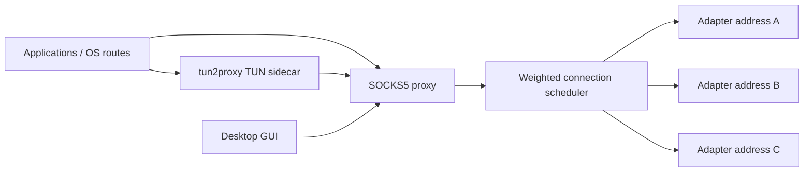

# net-combiner

[한국어](README.ko.md)

`net-combiner` is a desktop network combiner. It discovers local network
adapter addresses, lets you choose the links you want to use, and exposes them
as a single local SOCKS5 proxy. When VPN mode is enabled, local traffic is sent
through a bundled `tun2proxy` sidecar and then out through the selected
adapters.

The practical target is simple: make a workstation with more than one usable
network path easier to drive. Wi-Fi plus Ethernet, USB tethering plus Wi-Fi, or
several private overlay interfaces can be used from one local endpoint without
configuring every application by hand.

## Current Scope

- Native desktop GUI built with Rust and `egui`.
- Windows, macOS Intel, macOS Apple Silicon, and Linux release targets.
- Public/private adapter addresses shown by default, with an option to reveal
  link-local and loopback addresses.
- SOCKS5 no-auth proxy with TCP `CONNECT` and UDP `ASSOCIATE`.
- Per-connection egress selection with smooth weighted round-robin scheduling.
- Local VPN mode through `tun2proxy`.
- Connection monitor for live target, adapter, state, and byte counters.
- Log file rotation with UTF-8 output.
- English UI by default, Korean UI included.
- System tray on Windows and macOS.
- GitHub Releases based self-update for portable builds.

`net-combiner` is not a fork of `dispatch`; it reimplements the adapter-binding
idea in a new Rust application with a GUI, tray behavior, packaging, and a VPN
workflow.

## How It Works



The proxy binds each outbound connection to one of the selected local adapter
addresses. The scheduler chooses the adapter per connection, not per packet. A
single TCP connection therefore stays on one adapter, while multiple concurrent
connections are distributed across the selected links.

VPN mode starts the same proxy and then launches `tun2proxy`. The sidecar owns
the TUN routing work and forwards captured traffic back into the local SOCKS5
proxy.

## Installation

Download the latest release from:

<https://github.com/ivLis-Studio/net-combiner/releases>

Release assets are produced by GitHub Actions:

- `net-combiner-windows-x86_64-setup.exe`
- `net-combiner-x86_64-apple-darwin.pkg`
- `net-combiner-aarch64-apple-darwin.pkg`
- `net-combiner-x86_64-unknown-linux-gnu.deb`
- `net-combiner-portable-x86_64-pc-windows-msvc.zip`
- `net-combiner-portable-x86_64-apple-darwin.tar.gz`
- `net-combiner-portable-aarch64-apple-darwin.tar.gz`
- `net-combiner-portable-x86_64-unknown-linux-gnu.tar.gz`

The Windows installer places `net-combiner.exe`, `tun2proxy-bin.exe`, and
`wintun.dll` in the same installation directory. macOS `.pkg` and Linux `.deb`
packages install the app and the `tun2proxy` sidecar together. Portable archives
keep the same side-by-side layout and are the format used by the built-in
updater.

On macOS, unsigned builds may be stopped by Gatekeeper. The current packages are
intended for direct distribution and testing; code signing and notarization can
be added later without changing the application layout.

## Basic Use

1. Start `net-combiner`.
2. Select one or more adapter addresses.
3. Choose proxy mode if the target application can use SOCKS5 directly.
4. Choose VPN mode if local traffic should be routed through the proxy.
5. Open the connection monitor when you need to inspect live routing decisions.

Default SOCKS5 endpoint:

```text
127.0.0.1:1080
```

VPN mode normally requires administrator or root privileges because it creates a
TUN interface and changes routes. On Windows the application requests elevation
at startup.

## CLI

Run the GUI:

```powershell
cargo run
```

List adapter addresses:

```powershell
cargo run -- list
cargo run -- list --json
```

Start only the SOCKS5 proxy:

```powershell
cargo run -- proxy --bind 127.0.0.1 --port 1080 --egress 192.168.1.10/2 --egress 192.168.1.11/1
```

Start proxy plus TUN sidecar:

```powershell
cargo run -- vpn --port 1080 --egress 192.168.1.10 --tun2proxy C:\path\to\tun2proxy-bin.exe
```

## Build

Requirements:

- Rust 1.85 or newer.
- Platform GUI build dependencies.
- `tun2proxy` for local sidecar packaging.
- Inno Setup on Windows when building the setup executable.

Development build:

```powershell
cargo build
```

Local Windows package folder:

```powershell
powershell -ExecutionPolicy Bypass -File .\scripts\package-local.ps1
```

The application searches for `tun2proxy-bin` beside the executable, then inside
a `bin` directory, then on `PATH`.

## Release Process

Tag a version and push it:

```powershell
git tag v0.1.0
git push origin main --tags
```

The release workflow builds all configured targets, stages the sidecar binaries,
creates platform installers, uploads portable archives, and publishes the GitHub
Release.

The updater uses the release assets whose names contain both the target triple
and `portable`. Release builds embed the repository owner/name at compile time
from GitHub Actions, so forks can publish their own updater channel without code
changes.

## Operational Notes

- This is connection scheduling, not packet bonding.
- A single TCP transfer does not become faster by itself; many parallel flows
  can use multiple adapters.
- Some destinations or local networks may reject traffic sourced from a
  particular adapter address. Timeouts in that case usually mean the selected
  egress path cannot reach the target.
- Route policy differs by operating system. If VPN traffic loops back into the
  TUN device, add route exclusions or use proxy mode.
- Logs are written as UTF-8 and rotated when they grow large.

## License

MIT
